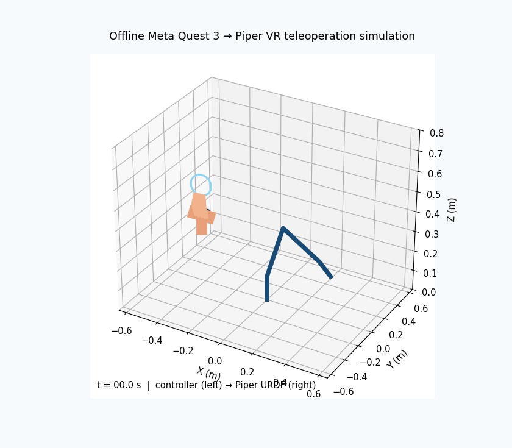

# Piper VR Teleop

Piper VR Teleop is a clean English reference project for controlling an AgileX Piper arm with a Meta Quest 3 controller. The Quest controller acts like a 3D target dot: after calibration, moving the controller moves the Piper end effector through Piper endpoint control.



The first working path uses Piper built-in endpoint IK through:

```python
arm.EndPoseCtrl(X, Y, Z, RX, RY, RZ)
```

No custom Jacobian IK solver is used in the main control loop.

## Hardware

- AgileX Piper arm
- CAN adapter
- Meta Quest 3 headset and controller
- USB-C cable for the first wired setup
- Ubuntu 20.04 or 22.04 laptop

## Software

- Python 3.9 recommended
- `android-tools-adb`
- `piper-sdk`
- `pure-python-adb`
- `numpy`
- `pyyaml`
- Optional ROS Noetic and catkin for users who want a ROS launch path
- Optional `pinocchio`, `casadi`, `meshcat`, and `rospkg` if matching parts of the upstream research environment

## Quick Start

```bash
git clone <your-repo-url> piper-vr-teleop
cd piper-vr-teleop
conda env create -f environment.yml
conda activate piper-vr
pip install -r requirements.txt
sudo apt update
sudo apt install android-tools-adb can-utils
```

Install AgileX's upstream Quest reader module and add it to `PYTHONPATH`:

```bash
cd ~
git clone https://github.com/agilexrobotics/questVR_ws.git
find ~/questVR_ws -type f | grep -i oculus
export PYTHONPATH=~/questVR_ws/src/oculus_reader/scripts:$PYTHONPATH
python3 -c "import oculus_reader; print('oculus_reader ok')"
```

Install the Quest teleop APK:

```bash
mkdir -p third_party/APK
# Place teleop-debug.apk at third_party/APK/teleop-debug.apk
scripts/install_quest_apk.sh
```

Connect the Quest by USB, put on the headset, and accept USB debugging.

Bring up CAN:

```bash
scripts/setup_can.sh can0 1000000
```

Test VR data:

```bash
python3 scripts/print_vr_data.py
```

Test Piper feedback:

```bash
python3 scripts/print_piper_pose.py --can can0
```

Before real robot mode, verify [piper_vr/piper_driver.py](piper_vr/piper_driver.py) uses Piper SDK V2 endpoint control:

```python
arm.ConnectPort()
arm.EnableArm(7, 0x02)
arm.ModeCtrl(0x01, 0x00, speed_percent, 0x00)
arm.EndPoseCtrl(...)
```

Run the direct endpoint wrapper test before debugging VR:

```bash
python3 scripts/test_piper_endpoint.py --can can0
```

Create a local configuration (the defaults use controller-local forward/right/up motion):

```bash
python3 scripts/create_teleop_config.py --can can0
```

Run dry-run teleop with verbose status:

```bash
python3 -m piper_vr.movep_teleop --config configs/local_piper.yaml --dry-run --verbose
```

Run real teleop only after the endpoint test moves and dry-run behaves correctly. Start with slow values:

```bash
python3 -m piper_vr.movep_teleop \
  --config configs/single_piper.yaml \
  --can can0 \
  --speed-percent 5 \
  --scale 0.40 \
  --max-speed 0.05 \
  --verbose
```

Required real-robot test order:

```bash
scripts/setup_can.sh can0 1000000
python3 scripts/test_piper_endpoint.py --can can0
python3 -m piper_vr.movep_teleop --config configs/single_piper.yaml --dry-run --verbose
python3 -m piper_vr.movep_teleop --config configs/single_piper.yaml --can can0 --speed-percent 5 --scale 0.40 --max-speed 0.05 --verbose
```

## Controls

- Right controller controls the single Piper by default.
- `A` calibrates the VR home pose to the current Piper end-effector pose.
- Release, then press and hold `rightGrip` to arm motion. Each new press is a clutch point, so controller motion while released is ignored.
- Releasing the deadman commands the measured current endpoint pose, stopping the arm instead of allowing it to finish an old target.
- By default, the endpoint keeps its calibrated orientation while the controller moves the arm in XYZ. Set `orientation_enabled: true` only after translation is tuned; controller rotation is then limited to ±45° roll/pitch, ±60° yaw, and 60°/s.
- Right trigger can control the gripper when `gripper_enabled: true`.
- `Ctrl+C` exits cleanly and sends a hold command.

All controls are configurable in [configs/single_piper.yaml](configs/single_piper.yaml).

## Safety Rules

- The robot never moves before calibration.
- The robot never moves unless the deadman is held.
- Workspace limits clamp the target position.
- Small Quest tracking jitter is removed with a configurable deadband and smoothing filter before endpoint commands are sent.
- Cartesian speed limiting prevents large endpoint steps.
- Tracking loss or stale Quest data causes a hold.
- A constrained IK guard built from the bundled Piper URDF rejects targets outside the six joint limits before they are sent to the firmware. Use `--no-urdf-guard` only for diagnosis.
- Real robot mode prints a warning before connecting.
- Start with dry-run and low speed.

## Command Path

```text
Quest controller pose
-> relative target mapping
-> workspace and speed safety
-> Piper EndPoseCtrl
-> Piper internal IK
-> joint movement
```

Internally, this project uses meters and degrees for readability. Piper endpoint command units are converted at the hardware boundary:

- XYZ: `0.001 mm`
- RX/RY/RZ: `0.001 degrees`

## URDF kinematic guard

The Piper model is pinned as the `third_party/agx_arm_urdf` Git submodule, sourced from AgileX's [`agx_arm_urdf`](https://github.com/agilexrobotics/agx_arm_urdf/tree/main/piper) repository. Initialize it after cloning this repository:

```bash
git submodule update --init --recursive
```

Before each endpoint command, the guard solves damped least-squares IK against `joint1` through `joint6`, respects the URDF hard limits, and holds the arm if no solution meets the 4 mm / 6° tolerance. It remains an endpoint-command guard: Piper firmware still produces the hardware joint command. That avoids using an unverified SDK joint-control interface.

## Offline URDF simulation

Render AgileX's detailed Piper visual DAE meshes with six joint sliders. This is fully offline and cannot communicate with CAN hardware:

```bash
python3 scripts/simulate_piper_urdf.py
```

To produce a shareable initial-pose image without opening a window:

```bash
python3 scripts/simulate_piper_urdf.py --no-gui --output outputs/piper_urdf.png
```

Record an offline mesh-motion test (all frames are checked against FK, IK, and URDF joint limits):

```bash
python3 scripts/record_piper_urdf_demo.py --output outputs/piper_urdf_motion_test.mp4
```

## Axis Mapping

The default mapping is controller-local: controller forward/right/up maps to Piper forward/right/up regardless of headset direction. If your Piper is mounted with a nonstandard base orientation, edit:

```yaml
axis_mapping:
  piper_x: "-vr_z"
  piper_y: "-vr_x"
  piper_z: "+vr_y"
```

See [docs/AXIS_MAPPING.md](docs/AXIS_MAPPING.md).

## Quest APK

This repository does not commit the upstream APK binary. Place it here:

```text
third_party/APK/teleop-debug.apk
```

See [docs/QUEST_SETUP.md](docs/QUEST_SETUP.md).

## Documentation

- [New laptop setup](docs/NEW_LAPTOP_SETUP.md)
- [Quest setup](docs/QUEST_SETUP.md)
- [CAN setup](docs/CAN_SETUP.md)
- [How it works](docs/HOW_IT_WORKS.md)
- [Axis mapping](docs/AXIS_MAPPING.md)
- [Troubleshooting](docs/TROUBLESHOOTING.md)
- [Upstream notes](docs/UPSTREAM_NOTES.md)

## Upstream Reference

This repository is based on ideas and architecture from AgileX Robotics `questVR_ws`, including the `oculus_reader` approach, Quest APK workflow, Piper ROS files, and single and dual Piper teleoperation examples. The implementation here is written as a clean English project focused on a safe first working endpoint-control path.
